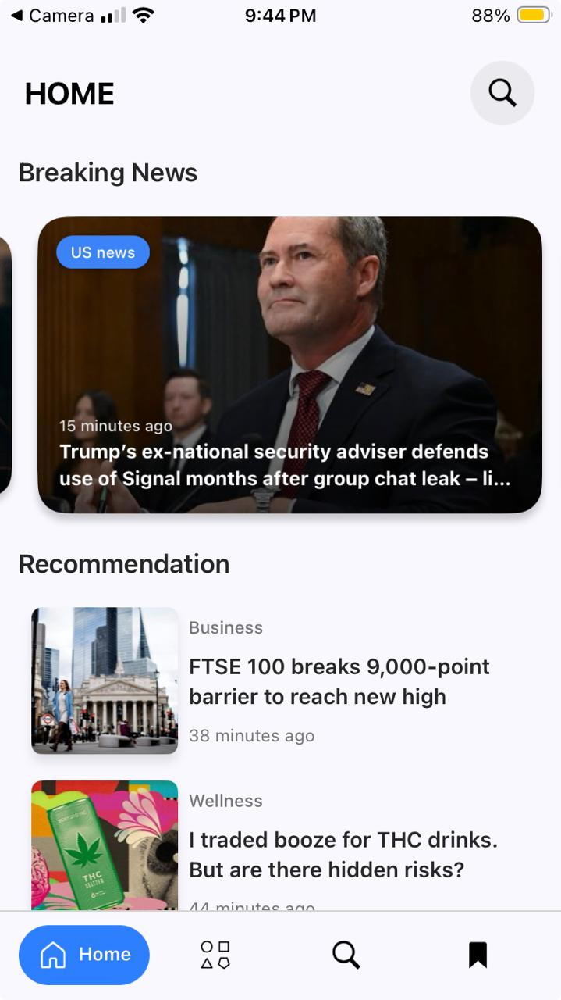
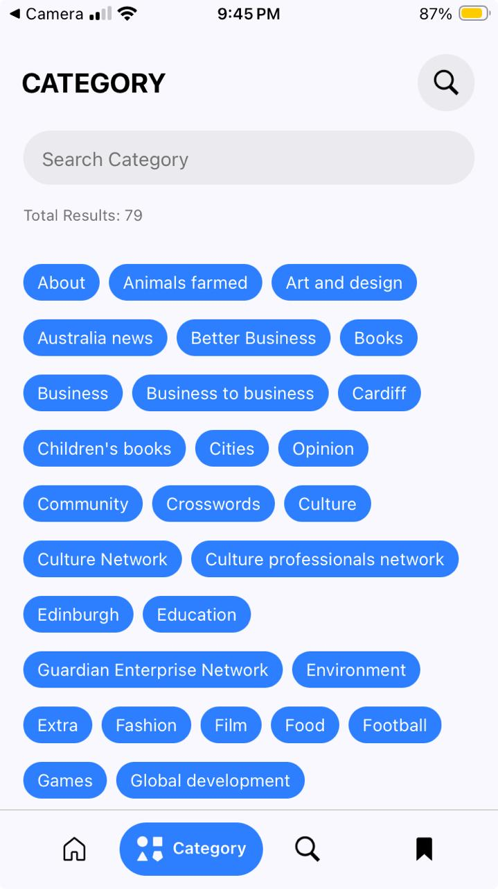
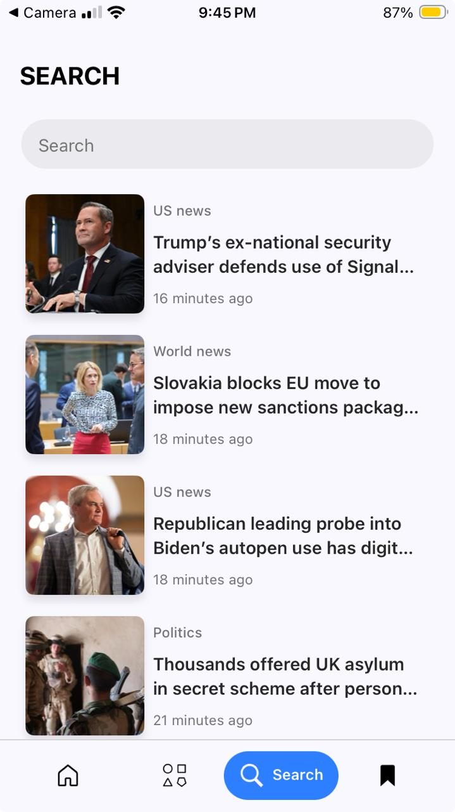
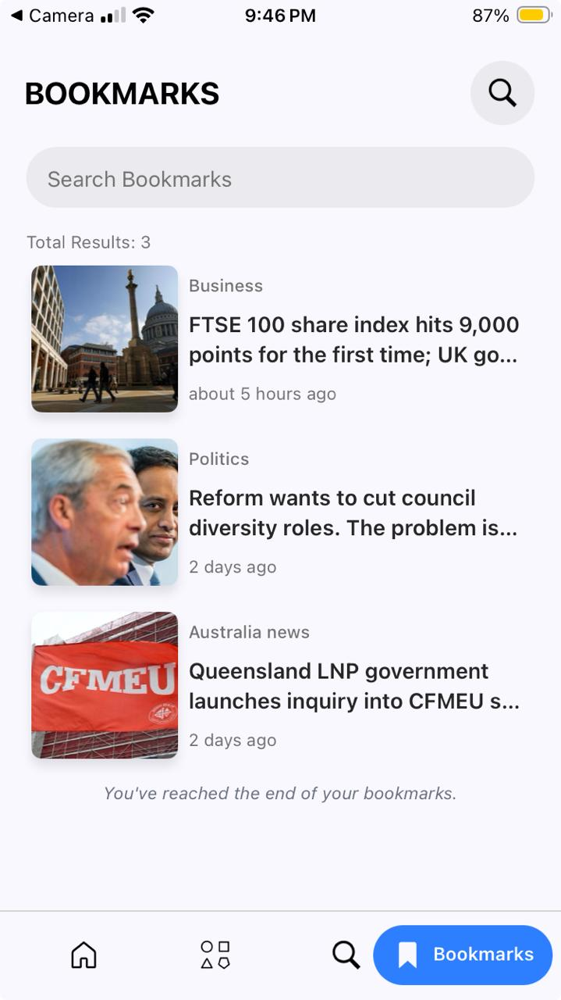
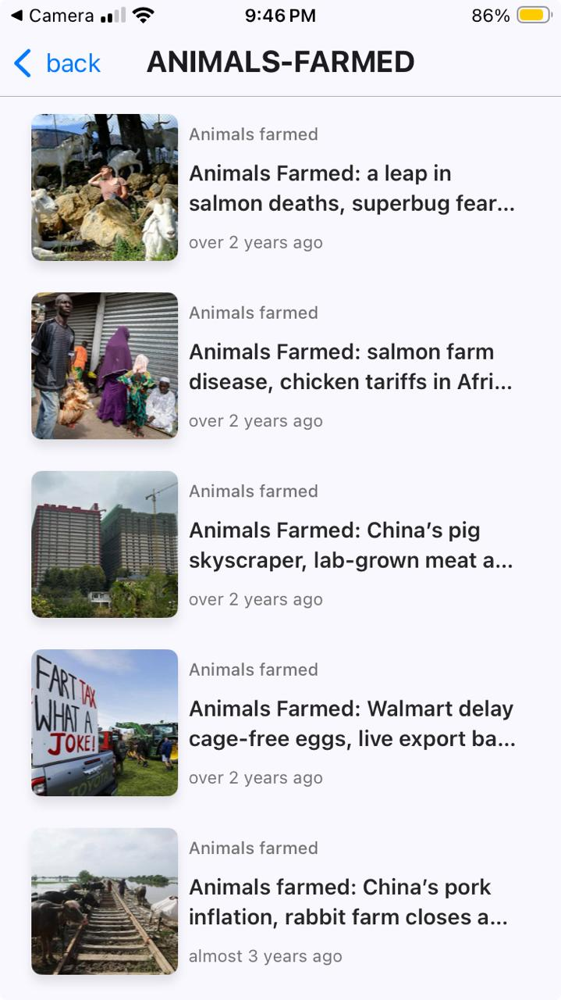

<div align="center">  </div> <h1 align="center">📰 Newslytics</h1> <div align="center"> <em>A beautifully crafted React Native news app powered by the Guardian API.</em> </div>

<br />

Newslytics is a sleek, modern news application built using React Native (Expo). It brings users up-to-date global news powered by the Guardian News API, complete with a smooth tabbed interface, category filtering, search functionality, and offline bookmark support via SQLite.

Thoughtfully developed with performance, modularity, and user experience in mind—Newslytics is your daily companion for staying informed.

## 📱 Features Overview

<div align="center">     </div> <br /> <div align="center">   </div>


### 🔸 Home Tab
- Displays **breaking news** in large featured cards.
- Below that, a **FlatList** shows the latest news in **tile-style cards**.
- All content fetched dynamically from the Guardian News API.

### 🔸 Categories Tab
- Lists news categories such as **Sports**, **Business**, and more.
- Selecting a category opens a **filtered feed** for that topic.

### 🔸 Search Tab
- Provides a global search functionality.
- Users can search for any news topic from the Guardian API.
- Infinite scrolling results in a clean tile layout.

### 🔸 Bookmarks Tab
- Displays all articles **bookmarked by the user**.
- Uses local **SQLite** database to store and manage bookmarks offline.

---

## 🗂️ Additional Screens

### 📂 Category Page
- Opened via the **Categories Tab**.
- Displays news specific to the **selected category**.

### 📰 Article View Page
- Opens when an article is selected from any screen.
- Shows full article content using its **Guardian ID**.
- Includes a **bookmark toggle** for saving or removing articles.

---

### 🧰 Tech Stack

- **React Native (Expo)**
- **React Navigation** with Bottom Tabs
- **SQLite (local DB)** for offline bookmark management
- **Guardian News API** for real-time news
- **Custom React Hook** to manage all API interactions
- **Clean and professional UI** using modular, reusable components

---

### 📂 Project Structure (Simplified)

```

/app                         # App screens & routes
│   ├── (tabs)/              # Tab screens: Home, Search, Categories, Bookmarks
│   ├── article/[id]/        # Dynamic article detail page
│   └── category/[category]/ # Dynamic category-based listing

/components/
│   ├── MyComponents/        # App-specific components (cards, skeletons, etc.)
│   └── ui/                  # Low-level shared UI components

/hooks/
│   └── useGuardianNews.ts   # Custom hook for API calls

/lib/
│   ├── database/            # SQLite logic
│   └── utils.ts             # General utility functions
│
├── constants/               # Centralized constants (e.g., assets)
├── types/                   # TypeScript interfaces & types
├── assets/                  # Fonts, icons, images
└── config & setup files     # Expo, TypeScript, nativewind, ESLint configs


```
---

### 🧠 How It Works

- A **single custom hook** handles all communication with the Guardian API (search, latest news, category filtering, article details).
- Bookmarks are handled through **SQLite**, providing offline persistence.
- App uses **React Navigation Tabs** for easy UX and intuitive layout.

---

### 👨‍💻 Developed by

**Shahzaib Awan**  
Crafted with care, clean UI principles, and optimized for smooth performance and maintainability.

---

<div align="center"> <strong>Thanks for exploring Newslytics! 🚀</strong> </div>
